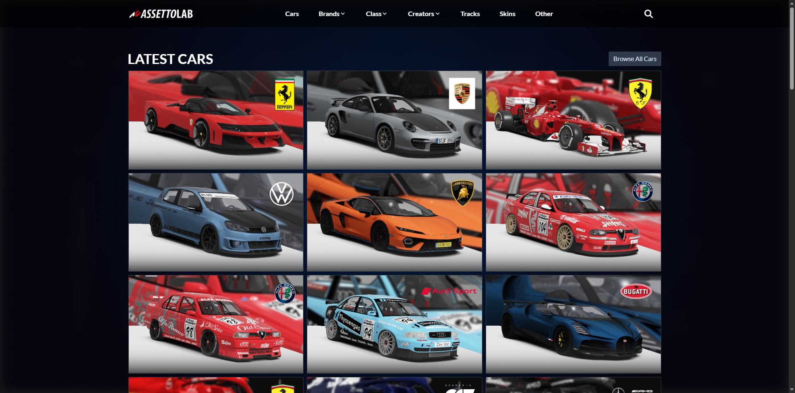
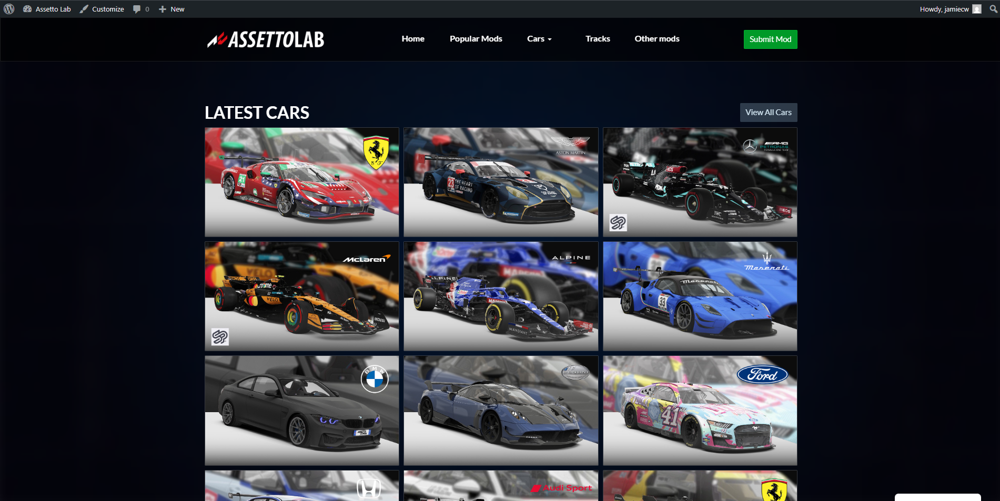
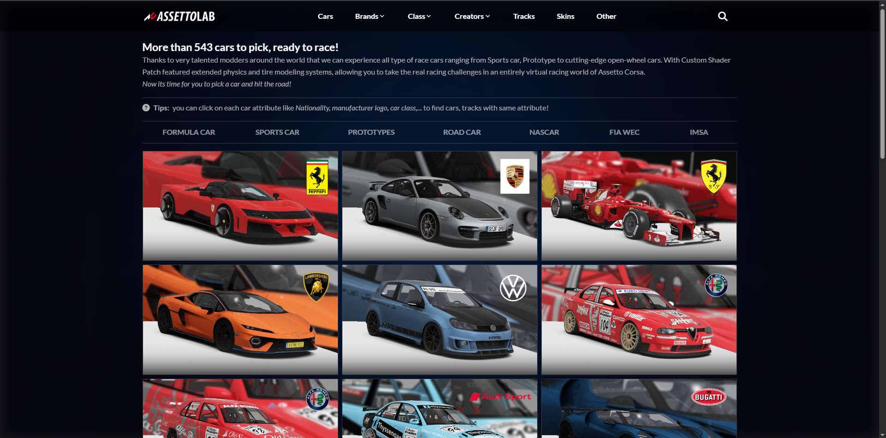
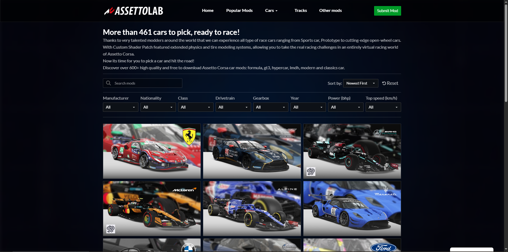
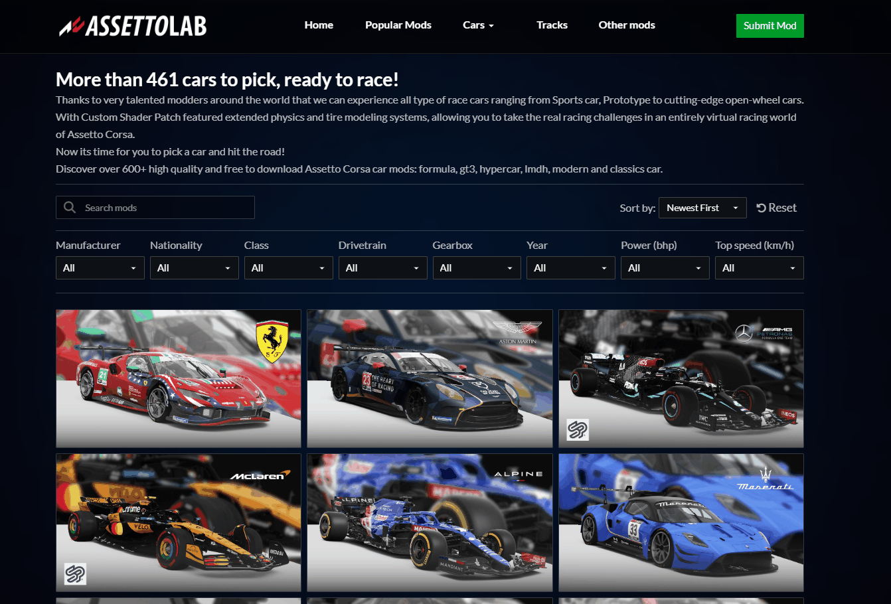

# 🚀 Case Study: Demo migrating from Hugo to WordPress with Custom Theme, AJAX Search, Star Rating, Dynamic Sorting & Pagination

## 🧭 Background

According to the author, this site originally started as a Hugo static site hosted on Cloudflare Pages. It was built to share Assetto Corsa mods, and featured clean content delivery, fast page loads, and simple Markdown-based content management.

The site hosted nearly 1,000 mod posts, and users often browsed multiple pages rapidly - resulting in high simultaneous pageview traffic. This was a real production system, the owner aimed for monetization via Google AdSense, with organic traffic spikes driven by search and mod discovery behavior.

While Hugo handled static delivery well, the lack of dynamic features like search and filtering began to show as limitations.

> This repo focuses solely on the technical side – site architecture, deployment, and performance tuning for high-read static content.

## 🎯 Objectives
- Migrate all legacy Hugo posts to WordPress while preserving full frontmatter metadata (e.g. title, date, tags, thumbnails), adapting them into appropriate ACF fields for structured content editing

- Rebuild the theme to replicate 90% of the original Hugo site’s design, with some enhancements to post layout using features like sliders and custom components where appropriate

- Implement dynamic features missing in Hugo:

  - View counter

  - Star rating system

  - AJAX-powered search and filtering

- Minimize plugin dependency as much as possible, only using select ones (e.g. for cookie handling) where it significantly reduces time/effort without compromising control

- Leverage AI like a code assistant — using it to reduce boilerplate time and syntax friction, while maintaining full ownership of the underlying logic and structure

## 🧱 Why Hugo Was Chosen Initially
- Lightweight static site generator with no backend — meaning zero infrastructure cost

- Cloudflare Pages was chosen for hosting due to its generous free tier and build limits (unlike Vercel or Netlify which throttle faster)

- While setup took time to understand, Hugo’s use of raw HTML templates made it easy to customize layouts and styles once I grasped the structure

- Content management was simple — Markdown-based posts, ideal for a mod-sharing site where each post is mostly media + frontmatter for metadata

- Perfect fit for a low-maintenance, high-speed site in its early phase, testing phase

## 🔄 Why I Moved to WordPress

- Managing content purely in Markdown became a serious bottleneck as the site scaled past 500–600 posts — especially for a solo maintainer

- Updating metadata, reordering, or modifying layouts in bulk was a nightmare with flat files

- We needed features more suited to a content-heavy mod sharing platform:

  - AJAX search, sort, pagination filtering

  - Image sliders and media-rich post layouts

  - Custom taxonomies and flexible relationships

- WordPress, as a full-featured CMS, offered a professional and intuitive backend for managing posts, categories, tags, and media

- Its vast ecosystem of customizable themes and plugins allowed rapid integration of advanced features without reinventing the wheel

- Most importantly, it provided future extensibility without sacrificing content structure or control
- WordPress also made it easier to meet AdSense cookie requirements using plugins like Complianz, instead of building a consent system from scratch.
- The move also allowed us to implement proper SEO structures and schema markup — critical for visibility and improving AdSense approval chances.

## 🎨 Theme Conversion: Rebuilding UI Without Knowing PHP
I had **zero experience** with PHP, JavaScript, or AJAX before starting this migration. Instead of relying on tutorials or full AI-generated themes, I:

- Reverse engineered the original Hugo layout and Tailwind CSS into a modular WordPress theme structure

- Used AI selectively to assist with specific PHP functions and WordPress hook logic

- Validated and debugged all AJAX-based features manually using DevTools and browser console

- Designed all key templates from scratch: homepage, archive list, single post, search results, etc.

- Mapped Hugo frontmatter metadata into structured ACF fields to render dynamic content consistently across templates

- Integrated Complianz for cookie consent handling — ensuring AdSense compliance without reinventing the wheel

- Applied schema markup and core SEO best practices across the theme to make it AdSense-ready from day one
  
Result: A lightweight, fully responsive WordPress theme that replicates nearly 100% of the original Hugo design, while introducing standout features like mega menu support, improved single post layout, and an overall more user-friendly experience.

## 📄 Post Conversion: Markdown → ACF Fields
All content from the Hugo site was originally written in Markdown, with YAML frontmatter containing metadata like title, date, tags, thumbnail, and category.

To migrate this to WordPress:

- I defined a clear data structure and used AI to help write a custom PHP parser script

- The script extracted frontmatter fields and mapped them into the appropriate WordPress post fields (title, slug, date, author, categories, tags) and ACF fields for extended metadata

- The script was run via Composer CLI, allowing structured import with full control and error handling

- I tested the parser in stages, initially converting and displaying parsed data without saving to DB — to verify field mapping, formatting, and encoding

- The script went through 7–8 refinement iterations before finalizing a clean version that imported posts in bulk and logged:

  - ✅ successfully imported post IDs

  - ❌ any failed items with filenames and error reason

- Final results were manually verified against the original Hugo output to ensure content and structure fidelity

- During import, I encountered a tricky issue where post dates were inconsistently parsed due to timezone offsets and format mismatches. After debugging and fallback logic, only ~40–50 posts out of 900+ had slightly incorrect dates — an acceptable margin for a one-time batch migration

## ⚙️ Feature Implementation

### 🔍 AJAX Search, Sort & Pagination

- Built fully dynamic browsing using admin-ajax.php and custom JS

- Supports live search, category filters, sort by latest/top-rated, and AJAX pagination — all without page reload

- Added slight artificial delay (150–200ms) before loading results to improve perceived smoothness and reduce UI jitter

- Smooth UX via pushState/history navigation, fallback for no-JS case

- AI assisted in crafting WP_Query logic and secure nonce handling

- During the migration, I also **refined the content structure**:
  - Removed outdated and irrelevant posts that no longer fit the site’s long-term direction
  - Trimmed frontmatter fields down to only the most useful metadata (e.g. version, source, tags, author)
  - Cleaned up naming inconsistencies across hundreds of entries
This made the ACF field mapping cleaner, more scalable, and aligned with future content strategy (e.g. SEO, monetization, and compliance).

> ⚠️ Note: Auto-scroll to top after changing page is not yet implemented.  
> This was scheduled as a polish task after deployment, but is currently delayed due to AWS account suspension.

### ⭐ Star Rating System

- Built with vanilla JS + PHP using AJAX — ratings stored as custom post meta

- Prevented double voting using cookies; UI locks stars after vote

- Data updates in real time (average + count), handled via inline JSON and data attributes

### 🖼️ Swiper.js Slider Integration

- Integrated Swiper.js for image galleries inside single posts

- Used custom ACF image repeater fields to allow flexible per-post gallery control

- Enhances visual presentation of mod previews, especially on mobile

### 👁️‍🗨️ Post View Tracking

>Initially implemented manually via localStorage + AJAX + post meta updates, but later replaced with a lightweight plugin to reduce code overhead and improve stability.

### 🎛 ACF Field Groups & Template Logic

- Custom ACF field groups for post types (e.g. mod version, credits, download link)

- Templates use get_field() / the_field() with fallback rendering

- Components built to be reusable and flexible across layouts (cards, list, single post)

## 🔐 Security Considerations

- Escaped all dynamic output fields (e.g. ACF values, post meta) using esc_html(), esc_attr(), etc. to reduce XSS risk

- Used nonces (wp_create_nonce, check_ajax_referer) for all AJAX endpoints to prevent unauthorized access

- Disabled XML-RPC and hid the default login URL to reduce bot spam and brute force exposure

- While not a full security audit, common best practices were applied manually — without relying on security plugins

## 🧪 Testing & Validation

- Measured AJAX response time (~100–150ms) across search, filter, and rating interactions

- Tested across all major browsers: Chrome, Firefox, Safari, and Edge

- Achieved Lighthouse score: 95+ despite using dynamic AJAX content

- Scored Pingdom: 95 (SF, USA) — strong global performance on lightweight infra

- Validated mobile responsiveness using Chrome DevTools, responsive emulator, and physical devices

- Verified fallback behavior with JS disabled and graceful degradation of dynamic components

## 🧠 Key Learnings

> I didn’t know PHP or AJAX when I started this migration — but I knew how to think in systems.

- I broke every unfamiliar piece into solvable parts: “How does ACF store structured fields?”, “How does WordPress process AJAX requests?”

- I used AI like a debugging partner, not a shortcut — it helped me speed up, not skip the work

- I validated each function manually: line by line, request by request, until I fully understood what was happening
- Migration wasn't just technical — I had to **rethink what content was worth keeping**, and how to structure it for long-term scalability and compliance

This project proved that you don’t need a front-end or PHP background to build something professional —
**you just need the mindset to debug, iterate, and own the system**

## 📸 Screenshots

> ⚠️ Some images in GIFs appear broken due to local `/wp-content/...` paths — they display normally in production. Not a functional issue.

### ✅ Homepage – Before & After Conversion

**Hugo Version**

**WordPress Version (with admin bar)**

---

### 📚 Post Archive – Before & After

**Hugo Version**

**WordPress Version**

---

### 📝 Single Post – Before & After

**Hugo Version**

**WordPress Version with Swiper Gallery**

---

### 🔍 AJAX Search, Filter & Sort (Live)

*Live filtering with no reload – powered by WP_Query + admin-ajax.php*

---

### 📄 AJAX Pagination

---

### ⭐ Star Rating System (AJAX)

*Vote once – instantly locked via cookie & real-time update*

---

### 🖼️ Swiper.js Slider (Inside Post)

*Image slider powered by ACF Repeater + Swiper.js*

---

### 🎫 Metadata Management via ACF

*Custom field groups for mod details, download link, author, version, etc.*

## ✅ Summary

This case study walks through a real-world migration from a static Hugo site to a fully dynamic, AdSense-ready WordPress system — built entirely by one person without prior experience in PHP, WordPress, or AJAX.

What started as a markdown-based mod-sharing site with 900+ posts soon became unmanageable. I rebuilt everything — the theme, content structure, dynamic features — by reverse-engineering, debugging, and leveraging AI as a code assistant, not a shortcut.

The end result:

- A custom WordPress theme that replicates 90–100% of the original Hugo design

- Dynamic AJAX search, filter, sort, and star rating

- Structured ACF fields for clean content management

- SEO + schema + cookie consent built in for AdSense readiness

- All handcrafted without heavy plugin reliance

Even small UX polish (like scroll-to-top on pagination) were planned, though postponed due to AWS account suspension — showing that this wasn’t just a dev exercise, but a system meant for **real deployment and traffic.**

“I didn’t clone a theme. I built one — with search, rating, filtering — as an infrastructure guy who simply needed a better frontend.”

---

📦 **Live Deployment & Infrastructure Optimization**

This WordPress project was later deployed, tuned, and tested under real traffic using LiteSpeed + Redis on a $0 AWS Free Tier instance — reaching 250 concurrent users at ~189ms response time.

🛠️ [See the full case study on WordPress + Redis + LiteSpeed on AWS →](https://github.com/aleixnguyen-vn/litespeed-redis-wordpress-on-aws)
